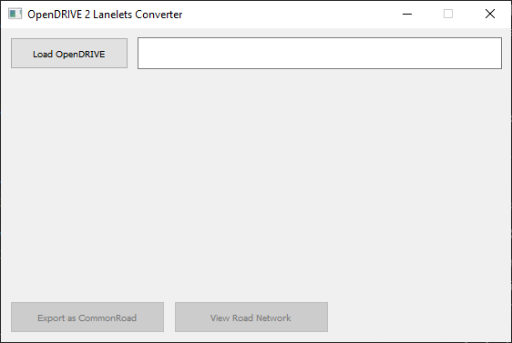
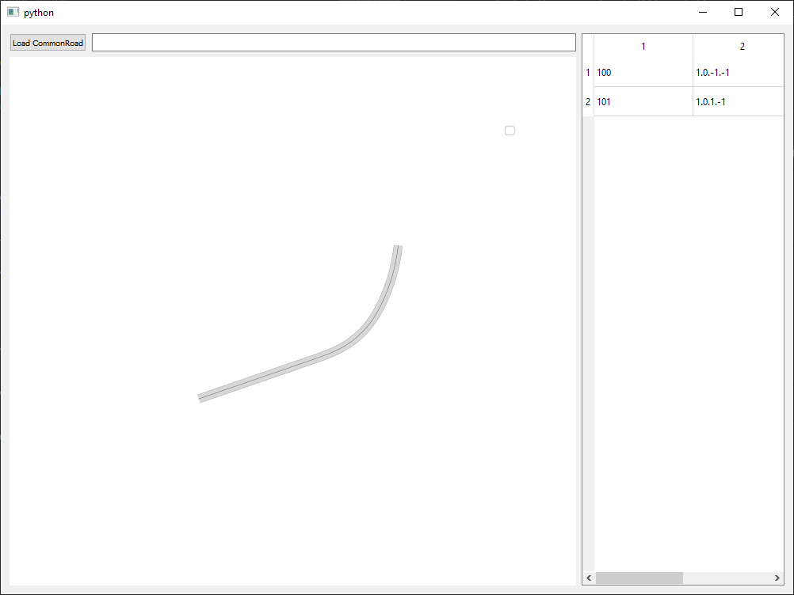

# OpenDrive with open source tools

## OpenDrive and software availability
ASAM OpenDrive is an open standard (https://www.asam.net/standards/detail/opendrive/) describing road networks and its elements (e.g. traffic signs, lanes). It has been used widely in industrial applications. However, there are numerous issues obstructing development for open-sopurce and academic:
- There are no reliable direct viewers besides VectorZero (https://www.vectorzero.io/)
  - There are some worth the try: https://github.com/fhwedel-hoe/OpenRoadEd
- VectorZero has been bought by MathWorks, now their software is part of Matlab 2021a (https://www.vectorzero.io/). No more demo version.
  - There are very nice tutorial though: https://www.mathworks.com/help/driving/ug/import-opendrive-roads-into-driving-scenario.html

Besides that, OpenDrive is very useful if you are using a simulator purposed for autonomous driving:
- CARLA (https://carla.readthedocs.io/en/latest/adv_opendrive/)
- LGSVL
- If you are very fortunate and own the whole toolchain based on MATLAB

## Reasons to care OpenDrive anyway
There are numerous possibilities to use XODR files anyway, for the following reasons:
- You want to rely an OpenDrive description because of its detailed description for navigation
- The geographic description is provided in this format by a 3rd party company


### Getting started with Common Road
Forutnately, the open standard of OpenDrive and its XML-based format made it possible to interchange between formats. A very promsiing project backed by Technische Universität München (TUM) to provide a common description for transportation networks: https://commonroad.in.tum.de/. It also have a very detailed format specification: https://gitlab.lrz.de/tum-cps/commonroad-scenarios/blob/master/documentation/XML_commonRoad_2020a.pdf. The project has been inspired relies on and somewhat a derivative of the Lanelet2 format and library:
- https://github.com/fzi-forschungszentrum-informatik/Lanelet2
- https://www.mrt.kit.edu/software/libLanelet/libLanelet.html

To use common road libraries start with installing it from PIP (assuming Python3):
```
pip3 install commonroad-io
```


To ensure the package is working, check out the tutorials here: https://commonroad.in.tum.de/getting-started. You may want to download the Github repository as well for test files and descriptions: https://gitlab.lrz.de/tum-cps/commonroad-collision-checker

Here is the Python script which has been tested at our side: in this case, the vehicle vaoid collision with a parking vehicle.
```python
import os
import matplotlib.pyplot as plt
from IPython import display

# import functions to read xml file and visualize commonroad objects
from commonroad.common.file_reader import CommonRoadFileReader
from commonroad.visualization.draw_dispatch_cr import draw_object

# generate path of the file to be opened
file_path = "ZAM_Tutorial-1_2_T-1.xml"

# read in the scenario and planning problem set
scenario, planning_problem_set = CommonRoadFileReader(file_path).open()

# plot the scenario for 40 time step, here each time step corresponds to 0.1 second
fig = plt.figure(figsize=(20, 10))
plt.ion()
for i in range(0, 40):
    # uncomment to clear previous graph
    #display.clear_output(wait=True)
    fig.clear()
    # plot the scenario at different time step
    draw_object(scenario, draw_params={'time_begin': i})
    # plot the planning problem set
    draw_object(planning_problem_set)
    plt.gca().set_aspect('equal')
    plt.show()
    plt.pause(0.1)
```

### Loading OpenDrive
Common road tools can be used to load OpenDrive files. First install the following packages from TUM LRZ:
```bash
pip install opendrive2lanelet
```
They also provide a GUI, which can be used after isntallation:
```
opendrive2lanelet-gui
```
Upon successful installation, you can see the GUI itself:



Load some XODR file. If you are lucky, you can see the following (for example _Ex_Line-Spiral-Arc.xodr_):



Besides visualization, you can export an Lanelet XML geometry information from the main gui.


#### Troubleshooting
Unfortunately, newest ```commonroad-io``` versions won't work with the visualizer.

The OpenDrive2Lanelet has been tested with ```commonroad-io 2020.2``` version, and it will work with it (as of June 2021). So downgrade ```commonroad-io```:
```bash
pip install commonroad-io==2020.2
```